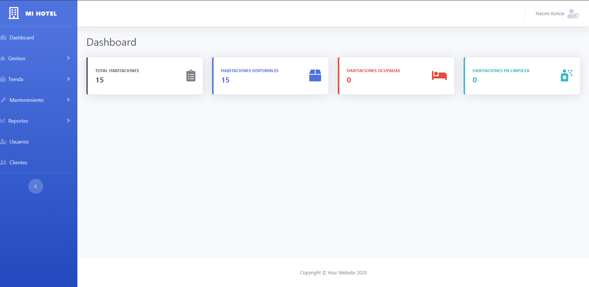
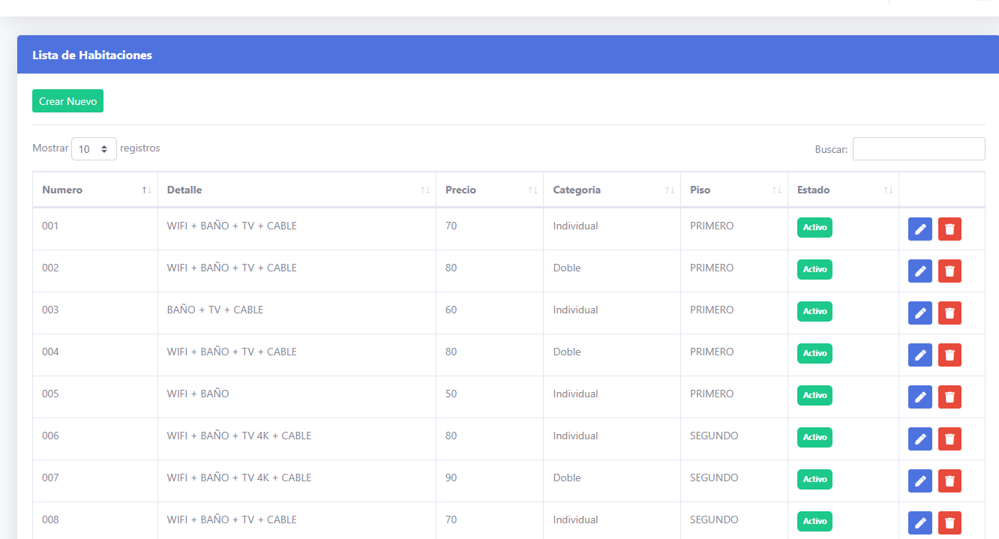
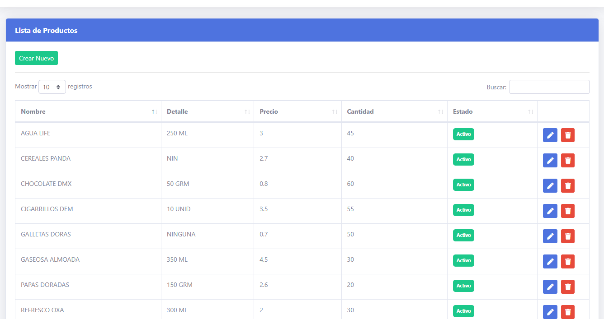
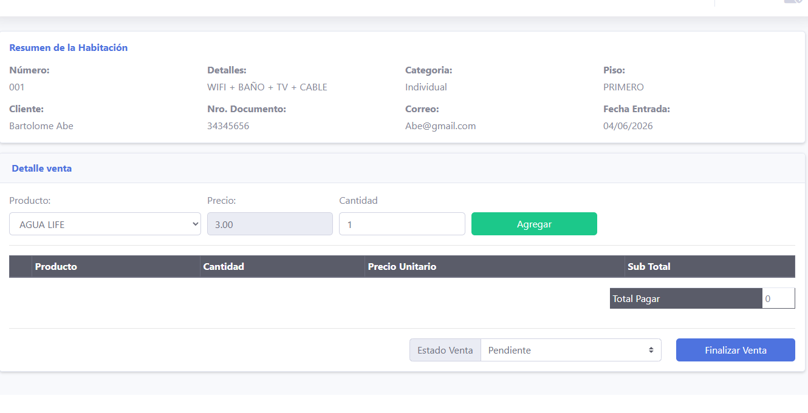
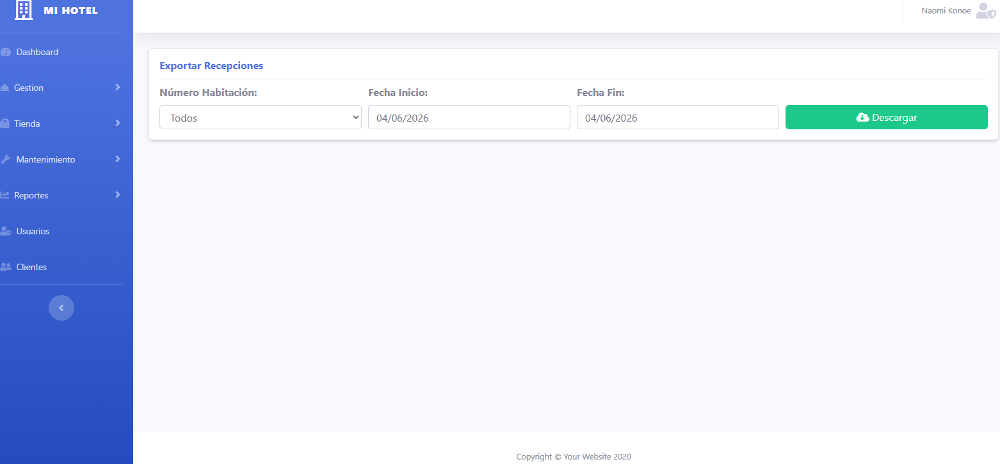

# Sistema de Gestión Hotelera

## Descripción

Sistema web desarrollado para la administración integral de hoteles, permitiendo gestionar habitaciones, huéspedes, inventario, ventas, reportes y control de usuarios desde una plataforma centralizada.

El objetivo del sistema es optimizar los procesos operativos del hotel, mejorar el control administrativo y facilitar la generación de información para la toma de decisiones.

---

## Funcionalidades Principales

### Gestión de Habitaciones

* Registro y administración de habitaciones.
* Control de disponibilidad.
* Gestión de alquileres y reservas.
* Seguimiento de ocupación.

### Gestión de Huéspedes

* Registro de clientes.
* Historial de hospedajes.
* Consulta de información de huéspedes.

### Inventario y Artículos

* Registro de artículos.
* Control de existencias.
* Gestión de entradas y salidas de inventario.
* Actualización de stock en tiempo real.

### Ventas

* Registro de ventas de productos y servicios.
* Emisión de comprobantes.
* Control de ingresos.

### Reportes

* Reportes de ventas.
* Reportes de ocupación de habitaciones.
* Reportes de inventario.
* Reportes administrativos.

### Seguridad y Usuarios

* Inicio de sesión seguro.
* Gestión de usuarios.
* Administración de roles y permisos.
* Auditoría básica de operaciones.

---

## Tecnologías Utilizadas

* ASP.NET MVC
* C#
* SQL Server
* Entity Framework
* Bootstrap
* JavaScript
* HTML5
* CSS3

---

## Arquitectura

El proyecto está desarrollado bajo el patrón MVC (Model-View-Controller), permitiendo una estructura organizada, mantenible y escalable.

### Estructura General

* **Models:** Entidades y acceso a datos.
* **Views:** Interfaces de usuario.
* **Controllers:** Lógica de negocio y control de flujo.
* **Utilidad:** Funciones auxiliares y componentes reutilizables.
* **SQL Server:** Almacenamiento de información.

---

## Módulos del Sistema

### Dashboard

Visualización general de información relevante para la administración del hotel.

### Gestión de Habitaciones

Administración de habitaciones, estados de ocupación y disponibilidad.

### Inventario y Artículos

Control de productos, existencias y movimientos de inventario.

### Ventas

Registro y control de ventas de productos y servicios.

### Reportes

Generación de reportes administrativos, operativos y financieros.

---

## Características Destacadas

* Gestión integral de hoteles.
* Control de inventario en tiempo real.
* Administración de huéspedes y habitaciones.
* Registro de ventas y movimientos.
* Reportes para la toma de decisiones.
* Sistema de autenticación y control de usuarios.
* Interfaz amigable y adaptable.

---

## Autor

**Erving Campos**

### Contacto

* GitHub: https://github.com/ErvinCAmpie

---

## Estado del Proyecto

Proyecto funcional desarrollado con fines de aprendizaje, práctica profesional  utilizando ASP.NET MVC y SQL Server.
